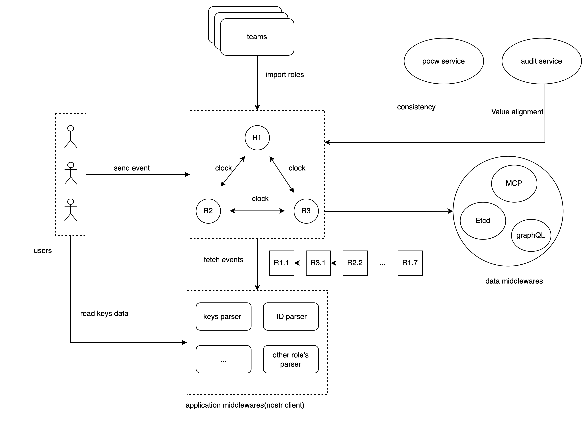

# Hetu Causality Graph

A decentralized data collaboration network that achieves fast, verifiable causality and data consistency off-chain through verifiable logical clocks and a POCW consensus protocol.

## Stack

Causality Graph is built on a robust architecture integrating several key components: SDK, TEE relays, composite database and graph dashboard. Each component plays a crucial role in maintaining causal consistency of the decentralized data collaboration.

### SDK ###

* Serves as the dApp interface for all interactions.
* EVM and Nostr compatible.

### TEE Relay ###
* Ensures secure and efficient data transmission
* Employ POCW for data consistency and reliability.
* Each relay node is responsible for propagating data changes across the network while maintaining causal order.

### Composite Database ###

* The database form a distributed graph-relation.
* They synchronize data from Nostr relays, ensuring data consistency and integrity.

### Graph dashboard ###

* Provides a visual interface for users to interact with the graph database.
* Allows exploration and manipulation of distributed documents.

