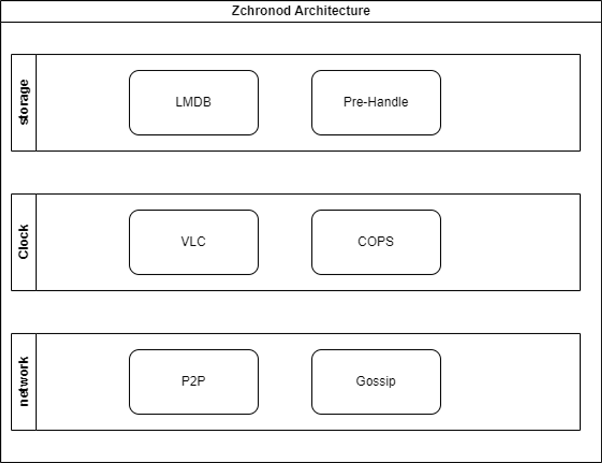
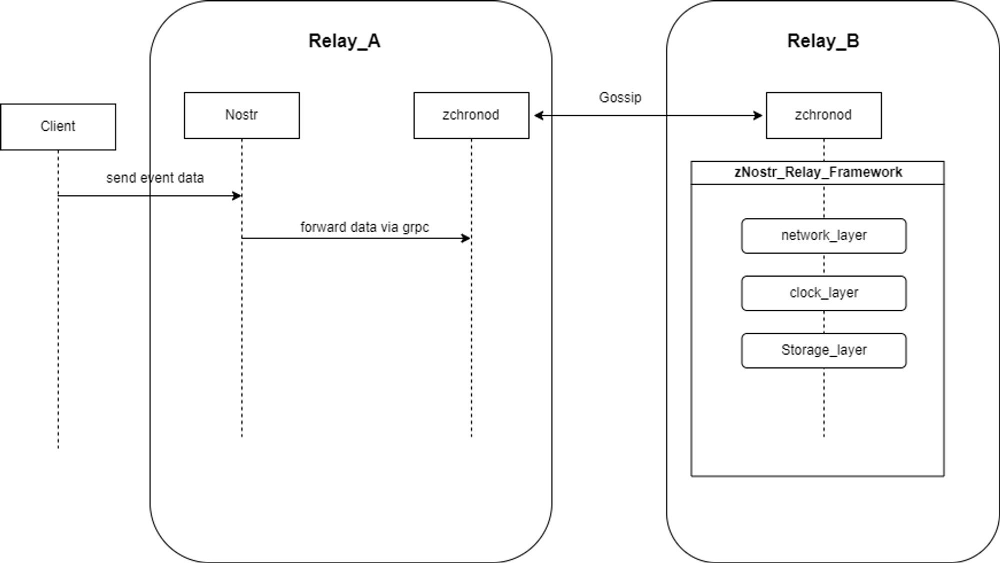

# How to implement VLC(verifiable logical clock) with Nostr protocol

### Add Nip3041 Feature
For applying the clock in Nostr, we designed a NIP feature which can use the verifiable 
logical clock as a "time unit" in a poll event at the background of distributed
system.

### Add Zchronod
In high level, The zSocial project consists of 3 roles: client, relay, and zChronod. The
client-relay is designed for forwarding and subscribing to Nostr_NIP-related protocols, 
compatible with industry-standard Nostr_Relay services and adapted Nostr_NIP3041. zChronod 
serves as the core service of zSocial, structured into three layers: a storage layer
utilizing key-value pairs with LMDB for excellent read/write performance. 
Clock layer implements improved Casual clocks to achieve eventual consistency 
in distributed gossip networks. Network layer uses gossip network  for cluster-wide
communication of zChronod cluster and set up gRPC services for establishing a simple 
and efficient P2P network with relay.
#### Architecture

<figure></figure>

- LMDB (Lightning Memory-Mapped Database) is an efficient, lightweight memory-mapped database which provide high-performance read/write operations, and fast retrieval.

- Pre_Handle is db_preprocessing module which identify poll_state data and related structs,  provides nip3041 vote_poll related computing capabilities based on lmdb and provide high-performance cache with bloom filter for rpc interface.

- Vlc is a causal sequential clock algorithm. Each event in zchronod will be causal ordering by prefix of vlc in zchronod node cluster to achieve final consistency eventually.

- A gossip network is a type of communication protocol used in distributed systems where nodes in the network communicate with each other by randomly selecting a few other nodes to share information. In a gossip network, nodes exchange information in a decentralized and probabilistic manner, similar to how rumors or gossip spread among individuals in a social network. 

### Data flow

<figure></figure>

Here is a basic outline of the process for sending an event to disk, using the example of the event initiation time:

1. The event is first sent to the Nostr Relay on Zchronod by client. The Nostr Relay verifies the basic format and signature of the event. If the verification is successful, the Nostr Relay acts as an RPC client and forwards the event to Zchronod.
2. Zchronod, acting as an RPC server, receives the event and forwards it to the Clock Layer.
3. The Clock Layer, upon receiving the event, attaches the current VLC (Vector Logical Clock) state based on the clock status and sends it through gossip to the Zchronod network.
4. Zchronod cluster nodes, upon receiving the event, validate it through the VLC. If the validation passes, the VLC is merged, and the event enters the storage layer for disk persistence.

