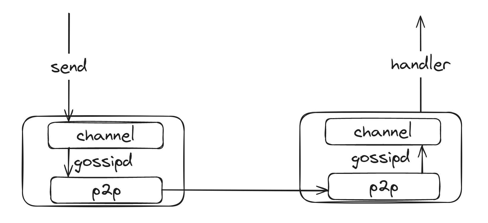

# gossipd
`gossipd` uese gossipsub to broadcast messages and mdns to maintain peers.



## example

[print](src/bin/main.rs)

```bash
// first shell
cargo build
cargo run

// second shell
// in first shell, it prints peer information like this /ip4/127.0.0.1/tcp/45678, you need to change 45678 to coresponsed id
cargo run -- /ip4/127.0.0.1/tcp/45678
```

## usage

```rust
// import
use gossipd::gossipd::{Gossipd, GossipdOptions};

// create gossipd options
let mut gossip_options = GossipdOptions::default();

// add peer you want to connect
gossip_options.add_peer(peer);

// create gossipd
let mut gossip = Gossipd::new(gossip_options);

// create a sender of channel
let tx = gossip.create_sender();

// handler message from channel
gossip.with_handler(|peer_id, message| {
    // your data is message.data
});

// start gossipd
tokio::spawn(async move { gossip.start().await });

// send message
tx.send();
```
